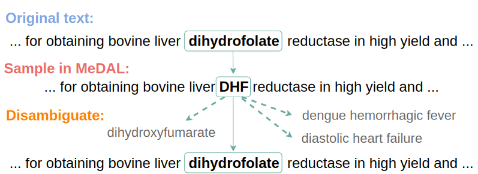

# MeDAL dataset



Repository for **Me**dical **D**ataset for **A**bbreviation Disambiguation for Natural **L**anguage Understanding (MeDAL), a large medical text dataset curated for abbreviation disambiguation, designed for natural language understanding pre-training in the medical domain. It was published at the ClinicalNLP workshop at EMNLP.

📜 [Paper](https://www.aclweb.org/anthology/2020.clinicalnlp-1.15/)\
💻 [Code](https://github.com/BruceWen120/medal)\
💾 [Dataset (Kaggle)](https://www.kaggle.com/xhlulu/medal-emnlp)\
💽 [Dataset (Zenodo)](https://zenodo.org/record/4265632)\
🤗 [Pre-trained ELECTRA (Hugging Face)](https://huggingface.co/xhlu/electra-medal)

<!-- 
🔥 [Pre-trained LSTM (Torch Hub)]() -->

## Model Quickstart

### Using Torch Hub

You can directly load LSTM and LSTM-SA with `torch.hub`:
```python
import torch

lstm = torch.hub.load("BruceWen120/medal", "lstm")
lstm_sa = torch.hub.load("BruceWen120/medal", "lstm_sa")
```

If you want to use the Electra model, you need to first install transformers:
```
pip install transformers
```
Then, you can load it with `torch.hub`:
```python
import torch
electra = torch.hub.load("BruceWen120/medal", "electra")
```

### Using Huggingface `transformers`

If you are only interested in the pre-trained ELECTRA weights (without the disambiguation head), you can load it directly from the Hugging Face Repository:

```python
from transformers import AutoModel, AutoTokenizer

model = AutoModel.from_pretrained("xhlu/electra-medal")
tokenizer = AutoTokenizer.from_pretrained("xhlu/electra-medal")
```

## Citation

To cite this project, download the `bibtex` [here](https://www.aclweb.org/anthology/2020.clinicalnlp-1.15.bib), or copy the text below:
```
@inproceedings{wen-etal-2020-medal,
    title = "{M}e{DAL}: Medical Abbreviation Disambiguation Dataset for Natural Language Understanding Pretraining",
    author = "Wen, Zhi and Lu, Xing Han and Reddy, Siva",
    booktitle = "Proceedings of the 3rd Clinical Natural Language Processing Workshop",
    month = nov,
    year = "2020",
    address = "Online",
    publisher = "Association for Computational Linguistics",
    url = "https://www.aclweb.org/anthology/2020.clinicalnlp-1.15",
    pages = "130--135",
}
```

## Downloading the data

### Using Zenodo

We recommend downloading from Zenodo if you do not want to authenticate through Kaggle. The downside to Zenodo is that the data is uncompressed, so it will take more time to download. Links to the data can be found at the top of the readme. To download from Zenodo, simply do:
```
wget -nc -P data/ https://zenodo.org/record/4276178/files/full_data.csv
```

If you want to reproduce our pre-training results, you can download only the pre-training data below:
```
wget -nc -P data/ https://zenodo.org/record/4276178/files/train.csv
wget -nc -P data/ https://zenodo.org/record/4276178/files/valid.csv
wget -nc -P data/ https://zenodo.org/record/4276178/files/test.csv
```

### Using Kaggle (authentication required)

We recommend downloading from Kaggle if you can authenticate through their API. The advantage to Kaggle is that the data is compressed, so it will be faster to download. Links to the data can be found at the top of the readme.

First, you will need to create an account on kaggle.com. Afterwards, you will need to install the kaggle API:
```
pip install kaggle
```

Then, you will need to follow the [instructions here](https://github.com/Kaggle/kaggle-api#api-credentials) to add your username and key. Once that's done, you can run:
```
kaggle datasets download xhlulu/medal-emnlp
```

Now, unzip everything and place them inside the `data` directory:
```
unzip -nq crawl-300d-2M-subword.zip -d data
mv data/pretrain_sample/* data/
```

### Loading FastText Embeddings

For the LSTM models, we will need to use the fastText embeddings. To do so, first download and extract the weights:
```
wget -nc -P data/ https://dl.fbaipublicfiles.com/fasttext/vectors-english/crawl-300d-2M-subword.zip
unzip -nq data/crawl-300d-2M-subword.zip -d data/
```

## Setting up for experiments

To reproduce the experiments, make sure to have the correct environment.

To get started, first clone this repo:

```
git clone https://github.com/BruceWen120/medal.git
cd medal
```

Create and activate a conda env:
```
conda create -n medal python=3.7.6
conda activate medal
```

Or a venv (make sure your `python3` is 3.6+):
```
python3 -m venv venv
source venv/bin/activate  # for Windows, use venv\Scripts\activate.bat
```

Install all the requirements:

```
pip install -r requirements.txt
```

## Instructions for Pre-training on MeDAL

The recommended way of training on MeDAL is using the `run.sh` script. The script runs the following command:

```
CUDA_VISIBLE_DEVICES=0,1 python run.py \
    --savedir "directory to save the model" \
    --model "model type (rnn, rnnsoft, electra)" \
    --data_dir "root directory of train/valid/test data files" \
    --adam_path "path to the adam mapping file" \
    --embs_path "path to pretrained fasttext embeddings" \
    --data_filename "data file filename (should be the same for train/valid/test)" \
    --epochs 10 \
    --lr 2e-6 \
    --use_scheduler \
    -bs 8 \
    --save_every 1 \
    --dropout 0.1 \
    --rnn_layers 3 \
    --da_layers 1 \
    --hidden_size 512 \
    --eval_every 200000 \
    # --pretrained_model "path to pretrained model"
```

`CUDA_VISIBLE_DEVICES=0,1` chooses the GPUs to use (in this example, GPU 0 and 1). The code supports using multiple GPUs or using CPU.

`run.py` is the main python file for training. Required parameters include:

- `savedir`: the root directory to save the model, logs, configs, etc.
- `model`: the model type, either "rnn" for LSTM, "rnnsoft" for LSTM + Self Attention, or "electra" for ELECTRA.
- `data_dir`: the root directory of data files, under which must include subdirectories `train`, `valid`, and `test`.
- `data_filename`: the data files' filename, which should be the same in `train`, `valid`, and `test`.
- `adam_path`: path to the ADAM abbreviation table file (`valid_adam.txt` in the `toy_data` folder).

The rest are optional parameters. Run command `python run.py --help` for detailed information of each parameter's functionality.

The intermediate and final results will be saved to `savedir/{timestamp}`, where the timestamp records the time this script starts to run, and is in the format of `{month}-{day}-{hour}-{minute}`.

The training process can also be monitored with Tensorboard, whose logs are saved to the `runs/{model type}-{timestamp}` directory under current directory. Launch tensorboard with `tensorboard --logdir=runs --port {some port}`, and it can be accessed through SSH on your local machine.

## Instructions for Downstream Tasks

### Preprocessing MIMIC

MIMIC is a restricted access dataset. You can access the dataset after you pass a test and formally request it on [their website](https://mimic.physionet.org/) (all the instructions are there).

When you have access, make sure to download the following files inside `data/`:
- ADMISSIONS.csv.gz
- PATIENTS.csv.gz
- DIAGNOSES_ICD.csv.gz
- PROCEDURES_ICD.csv.gz
- NOTEEVENTS.csv

(notice you need to `gunzip` `NOTEEVENTS.csv.gz`).

Then, you can run the preprocessing script:
```
python preprocess/mimic.py --save_dir ./data --mimic_dir ./data
```

Change `mimic_dir` if you saved your MIMIC files somewhere else.


### Training on downstream MIMIC tasks

Training on downtream tasks is similar to training on MeDAL. The recommended way of training on downstream tasks (mortality prediction and diagnosis prediction) is using the `run_downstream.sh` script in the `downstream` folder. The script runs the following command:

```
CUDA_VISIBLE_DEVICES=0 python run_downstream.py \
    --savedir "directory to save the model" \
    --model "model type (rnn, rnnsoft, electra)" \
    --task "downstream tasks (mimic-diagnosis, mimic-mortality)" \
    --data_dir "root directory of train/valid/test data files" \
    --data_filename "data file filename (should be the same for train/valid/test)" \
    --diag_to_idx_path "path to diag_to_idx file" \
    --embs_path "path to pretrained fasttext embeddings" \
    --epochs 10 \
    --lr 2e-6 \
    --use_scheduler \
    -bs 8 \
    --save_every 1 \
    --dropout 0.1 \
    --rnn_layers 3 \
    --da_layers 1 \
    --hidden_size 512 \
    --eval_every 30000 \
    --pretrained_model "path to the model pretrained on medal" \
```

`CUDA_VISIBLE_DEVICES=0` chooses the GPUs to use (in this example, GPU 0). The code currently supports using CPU, but **does not support fine-tuning pretrained models with multiple GPUs**. It will not cause an error, but the pretrained weights will not be loaded correctly.

`run_downstream.py` is the main python file for training. Required parameters include:
- `savedir`: the root directory to save the model, logs, configs, etc.
- `model`: the model type, either "rnn" for LSTM, "rnnsoft" for LSTM + Self Attention, or "electra" for ELECTRA.
- `data_dir`: the root directory of data files, under which must include subdirectories `train`, `valid`, and `test`.
- `data_filename`: the data files' filename, which should be the same in `train`, `valid`, and `test`.
- `task`: the downtream task to train on, either "mimic-mortality" or "mimic-diagnosis".

If training on diagnosis prediction, the `diag_to_ix` file (`diag_to_idx.pkl` in the `toy_data` folder). that contains the indices for diagnosis codes is also required to be passed to `diag_to_idx_path`.

The rest are optional parameters. Run command `python run_downstream.py --help` for detailed information of each parameter's functionality.

The intermediate and final results will be saved to `savedir/{timestamp}`, where the timestamp records the time this script starts to run, and is in the format of `{month}-{day}-{hour}-{minute}`.

The training process can also be monitored with Tensorboard, whose logs are saved to the `runs/{task}/{model type}-{timestamp}` directory under current directory. Launch tensorboard with `tensorboard --logdir=runs --port {some port}`, and it can be accessed through SSH on your local machine.

## License, Terms and Conditions

The ELECTRA model is licensed under [Apache 2.0](https://github.com/google-research/electra/blob/master/LICENSE). The license for the libraries used in this project (`transformers`, `pytorch`, etc.) can be found in their respective GitHub repository. Our model is released under a MIT license.


The original dataset was retrieved and modified from the [NLM website](https://www.nlm.nih.gov/databases/download/pubmed_medline.html). By using this dataset, you are bound by the [terms and conditions](https://www.nlm.nih.gov/databases/download/terms_and_conditions_pubmed.html) specified by NLM:

> INTRODUCTION
> 
> Downloading data from the National Library of Medicine FTP servers indicates your acceptance of the following Terms and Conditions: No charges, usage fees or royalties are paid to NLM for this data.
> 
> MEDLINE/PUBMED SPECIFIC TERMS
> 
> NLM freely provides PubMed/MEDLINE data. Please note some PubMed/MEDLINE abstracts may be protected by copyright.  
> 
> GENERAL TERMS AND CONDITIONS
> 
>    * Users of the data agree to:
>        * acknowledge NLM as the source of the data by including the phrase "Courtesy of the U.S. National Library of Medicine" in a clear and conspicuous manner,
>        * properly use registration and/or trademark symbols when referring to NLM products, and
>        * not indicate or imply that NLM has endorsed its products/services/applications. 
>
>    * Users who republish or redistribute the data (services, products or raw data) agree to:
>        * maintain the most current version of all distributed data, or
>        * make known in a clear and conspicuous manner that the products/services/applications do not reflect the most current/accurate data available from NLM.
>
>    * These data are produced with a reasonable standard of care, but NLM makes no warranties express or implied, including no warranty of merchantability or fitness for particular purpose, regarding the accuracy or completeness of the data. Users agree to hold NLM and the U.S. Government harmless from any liability resulting from errors in the data. NLM disclaims any liability for any consequences due to use, misuse, or interpretation of information contained or not contained in the data.
>
>    * NLM does not provide legal advice regarding copyright, fair use, or other aspects of intellectual property rights. See the NLM Copyright page.
>
>    * NLM reserves the right to change the type and format of its machine-readable data. NLM will take reasonable steps to inform users of any changes to the format of the data before the data are distributed via the announcement section or subscription to email and RSS updates.
